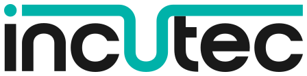

# Contributing to OpenDrone

[](https://discord.gg/v3sWmTcx3R)
[](https://www.youtube.com/@justfpv1432)
[](https://opendrone.be)
[](https://ohwr.org/cern_ohl_s_v2.txt)

---

> <picture>
>   <source media="(prefers-color-scheme: dark)" srcset="profile/incutec-ondark.svg">
>   
> </picture>
>
> A startup in Belgium. Incutec started OpenDrone, but
> the project is not owned by us: the designs are open and the direction belongs
> to the people.
>
> Our intent is to sell the products of OpenDrone and use those profits to
>
> **A** &nbsp; Invest in development by ordering samples, testing, providing foundational hardware to build from
>
> **B** &nbsp; Invest in manufacturing, detailed on [opendrone.be/production](https://opendrone.be/production)
>
> Incutec handles: production, quality control, sourcing parts, building supply
> chains, putting things in a box with accessories and shipping it, and the legal
> responsibility for a product sold.
>
> The company needs revenue, this is how it is different from code repositories.
> But if Incutec disappears tomorrow, OpenDrone lives on.

## Why Contribute?

Open Source hardware is not short of good intentions. It is short of constraints and a common goal, which is why so much of it ends up as one-off designs nobody else can build on. That is the part we are trying to fix.

We believe OpenDrone can function as a proof that Open Source hardware development can be just as good, or better, than commercial hardware. Having anybody being able to view and contribute to a design means the people get to decide what works for them.

Not to mention repairability or the educational value of good, maintained designs.

Design files are not a trade secret worth keeping. Unless you are genuinely doing something state of the art, holding them back buys you very little and costs everyone else a lot.

Working on OpenDrone means learning from others, discussing problems in the open, and staying close to the firmware devs. You get named for what you do. And your design might actually get built and sold on opendrone.be.

## Two kinds of designs

| | Electronics | Mechanical |
|---|---|---|
| Authored in | KiCad | Onshape or FreeCAD, whichever the repo declares |
| The Repository | The design itself | The CAD source, plus the exports suppliers get: STEP and drawings |
| Version Control | git | git, or Onshape's own versions and branches |
| Getting access | Fork the repo | Fork the repo. Onshape documents are by invite |

New to the tools? Explore their documentation here.

[](https://www.kicad.org/)
[](https://docs.kicad.org/)
[](https://www.freecad.org/)
[](https://wiki.freecad.org/)
[](https://www.onshape.com/)
[](https://learn.onshape.com/)

The firmware is not ours but just like the hardware, it's Open Source. Here's the repos.

[](https://github.com/betaflight/betaflight)
[](https://github.com/am32-firmware/AM32)
[](https://github.com/ExpressLRS/ExpressLRS)

## How to contribute

> You don't need permission. Have fun. Just communicate what you're up to. We trust
> in the idea that this will stabilise in a feedback loop where designs are iterated on
> and developed in a democratic, distributed way. If you see something you think you can improve, do it!

**1. Say it on Discord.** What you want to change. Someone may
already be on it, might have experience or good ideas.

**2. Fork it and change it.**

```sh
gh repo fork OpenDrone-hw/<repo> --clone   # your own copy, cloned locally
cd <repo>
git submodule update --init                # pulls the shared parts library
git checkout -b my-change                  # work on a branch, not on main
```

**3. Open a pull request.** Say what you changed and why.

**4. Someone reviews it.** Please discuss issues openly in the right discord channel. Someone else might be able to help.

You do not have to design anything to be useful here. Reading a schematic and asking
"why is this pull-up 10k" is a real contribution.

---

# The life of a project

Every repo starts as a copy of
[hardware-template](https://github.com/OpenDrone-hw/hardware-template)

What changes is how much of it is real, and the `status-*` topic says
how far along that is. It drives the roadmap on opendrone.be.

| | Stage | Buyable | What is real | What it needs |
|---|---|---|---|---|
| 1 | [Planned](#1-planned) | no | The specification | Research, parts, opinions |
| 2 | [In progress](#2-in-progress) | no | The design | Drawing, review |
| 3 | [Alpha](#3-alpha) | no | The board | Flying it, breaking it |
| 4 | [Beta](#4-beta) | yes | The product | Reports from real use |
| 5 | [Launched](#5-launched) | yes | All of it | Revisions |

> [!NOTE]
> Moving status is generally reserved for Admins or members of the Incutec team
> as it has an impact on the OpenDrone.be website.

## 1. Planned

No design exists yet. The specification is being argued out on Discord. No
product page.

`README.md` is the one file that is properly written: what we want built, why,
the constraints it has to meet, prior art and the open questions, `research/` grows
as component selection gets worked out.

<details>
<summary>Starting a new product repo</summary>

1. `Use this template` on
   [hardware-template](https://github.com/OpenDrone-hw/hardware-template).
2. Write the specification into `README.md`
3. `gh repo edit OpenDrone-hw/<repo> --add-topic status-planned`

</details>

Moves on when someone claims it and starts a KiCad project.

## 2. In progress

The design is being drawn. Prototypes may be ordered. Schematics may change; do
not build from them.

> [!IMPORTANT]
> KiCad files cannot be merged. 
> If two people edit the same `.kicad_pcb`, one of them loses their work.
> That's why communication is so important. We think Discord is the right platform for this.

### Don't start from nothing

| Mechanism | Where | Purpose |
|---|---|---|
| Project template | `hardware-template`, via `File > New Project from Template` | A new board starts on the line standard |
| Board Setup > Import Settings from Another Board | One-off, from the template | Brings an existing board onto it: stackup, constraints, presets, rules |
| `.kicad_dru` | Per project, committed, canonical block copied from the template | Custom rules as reviewable text, not GUI state |
| Lib tables | Project-local, `${KIPRJMOD}` relative | Portable paths. Global libraries are never used: they make a repo build only on the machine that has them |

 `.kicad_dru` holds custom rules only for example the ESCs run 2 oz outer copper and need
0.16 mm clearance on the outer coppor layers.

### Parts: Reduce, !Reuse!, Recycle?

[OpenDrone-hw/KiCad-Library](https://github.com/OpenDrone-hw/KiCad-Library) is
the catalogue of parts that have actually been manufactured.

A symbol, footprint or 3D model is in there only if it is used on a board at
`status-alpha` or beyond, so everything has probably survived at least one production run.

`PARTS-USED.md` lists every part and which boards use it. Copy the symbol and
footprint into the board repo's local `lib` library rather than referencing
them: a KiCad project keeps working when the shared library changes.

As of 13/09/2026: Boards are assembled by [JLCPCB](https://jlcpcb.com/) from
[LCSC](https://www.lcsc.com/) parts. So each component needs an LCSC field. 
As Incutec moves into in-house assembly, using manufacturer part numbers (MPN) becomes the standard. So using both is a plus!

<details>
<summary>Repository structure from here on</summary>

| File | Audience | Contains |
|---|---|---|
| `README.md` | Consumers, curious learners | Renders, one paragraph, where it sits in the line, what it does and basic specifications |
| `AGENTS.md` | Developers or agents | Architecture, key parts, power, connectors, layout constraints, revisions. |
| `CONTRIBUTING.md` | A contributor | A stub pointing here. |
| `LICENSE` | Everyone | CERN-OHL-S-2.0, identical across repos. |

`AGENTS.md` is [an open format](https://agents.md) most agent tools read. Keep it up to date with the KiCad files as a technical write-up of the design.

**Single Board.** Examples: [OpenFC-Lite](https://github.com/OpenDrone-hw/OpenFC-Lite), [OpenFC-Lite-Mini](https://github.com/OpenDrone-hw/OpenFC-Lite-Mini), [OpenESC-30x30](https://github.com/OpenDrone-hw/OpenESC-30x30), [OpenESC-20x20](https://github.com/OpenDrone-hw/OpenESC-20x20)

```
<repo>/
├── README.md  AGENTS.md  CONTRIBUTING.md  LICENSE
├── .gitignore  .gitattributes  .gitmodules
├── images/                     # README renders
├── libs/KiCad-Library/         # submodule
└── hardware/                   # the KiCad project, exactly one level down
    ├── <project>.kicad_pro / .kicad_sch / .kicad_pcb
    ├── <project>.kicad_dru            # committed
    ├── fabrication-toolkit-options.json
    ├── fp-lib-table  sym-lib-table    # project-local only
    ├── lib.kicad_sym  lib.pretty/  lib.3dshapes/
    ├── datasheets/    # gitignored
    ├── production/    # gitignored working exports
    └── tools/         # board-specific scripts only
```

**Multi-Board designs.** Example: [OpenRX](https://github.com/OpenDrone-hw/OpenRX). One directory per variant at repo root,
each with its own KiCad project.

**Mechanical.** Example: [OpenFrame](https://github.com/OpenDrone-hw/OpenFrame). One directory per size or variant, holding the CAD source, the STEP files and the drawings. 

The project directory sits **exactly one level below the repo root**, because 3D
model paths resolve as `${KIPRJMOD}/../libs/KiCad-Library/3dmodel/<file>`.

**Commit:** schematic, PCB and project source; project-local libraries;
`.kicad_dru`; `fabrication-toolkit-options.json`; the four root files;
`hardware/tools/`; `images/`.

**Ignore:** backups, autosave, locks, `*.kicad_prl`, `*.net`, `fp-info-cache`,
`.history`, `datasheets/`, working `production/`, `*.glb`, `export/`, analysis
dumps, and vendor-specific agent files.

</details>

**Moves on when boards have been made** and are in the hands of testers.

## 3. Alpha

Produced. Tested inside the project: community testers and firmware maintainers.
Not buyable. Ask for samples if you'd like to help testing. A product page may
exist on opendrone.be allowing for people to sign up to be notified when it moves
into beta.

`images/` gets real renders and the
repo gets its first `rev*` tag with the fab set and STEP attached. Its parts join
the shared library, having survived a production run.

Somewhere between alpha and beta a board gets a video on
[JustFPV](https://www.youtube.com/@justfpv1432): what it is, how it works in a fun 
educational manner. If you designed part of it, you are named for it or featured, depending on what you'd like.

One board revision is one tag and one GitHub release. The procedure and the shared
tooling are in `OpenDrone-Scripts/README.md` under "Release procedure".

**Moves on when the design is settled, tested and reviewed enough to sell.**

## 4. Beta

Buyable, first production batch.

The repo is complete by now: `README.md` reads as a product page, `AGENTS.md`
describes the board that is actually in the box. 

**Moves on when the design stops changing between batches.**

## 5. Launched

Buyable, design will not change. A change from here is a new product.

---

# Who can change what

| Role | How you get it | What it lets you do |
|---|---|---|
| **Anyone** | A GitHub account | Open issues, open pull requests from a fork, review anyone's pull request, argue on Discord. Most contribution happens here and needs no status at all. |
| **Contributor** | One merged pull request | Named in the contributors chapter of the product page. How you work does not change. |
| **Board maintainer(s)** | Named in that repo's `AGENTS.md`| You hold the board. You approve or refuse design changes to it, decide what constitutes a revision. |
| **Organisation member** | Invitation, after sustained contribution. | Push branches directly instead of working from a fork |
| **Admin** | Incutec Staff | Releases, fab orders, secrets, org settings. Anything with money or legal exposure attached. |

# AI usage

| | |
|---|---|
| ✅ | Research and datasheet reading, component search and sourcing, BOM work, library management, running ERC, DRC checks and explaining what came back, documentation, and project management. |
| ❌ | It does not (yet) make schematics, place parts or route a board. |

# Licensing

Hardware is licensed [CERN-OHL-S-2.0](https://ohwr.org/cern_ohl_s_v2.txt), a
reciprocal copyleft licence: modify a board, ship your version, and if someone
asks for your sources you hand them over on the same terms. The point is not to
stop clones but for everybody to share their improvements.

GitHub does not auto-detect CERN-OHL-S, so it reports our repos as
`NOASSERTION`. The `LICENSE` file at the repo root is the authoritative text.

**Names.** *incutec* is a registered trademark. *OpenDrone* is not, and we make
no trademark claim over it. So: build the designs, sell them, call them what
you like. What you cannot do is present your product as an official incutec
product, or use incutec branding in a way that suggests we made, tested or
support it. Describing what your board is based on is fine and always will be.

**Bundled third-party assets.** A handful of 3D models carry their own upstream
licences, CC-BY-SA-4.0 or GPL, in a notice embedded in the file itself. Those
notices still apply to those files; the repository licence does not replace
them. Where a repo bundles any, it says so in its README.

# Questions

Discord first: https://discord.gg/v3sWmTcx3R

A GitHub issue on the relevant repo works too, and is the right place for
anything that should be findable later.
