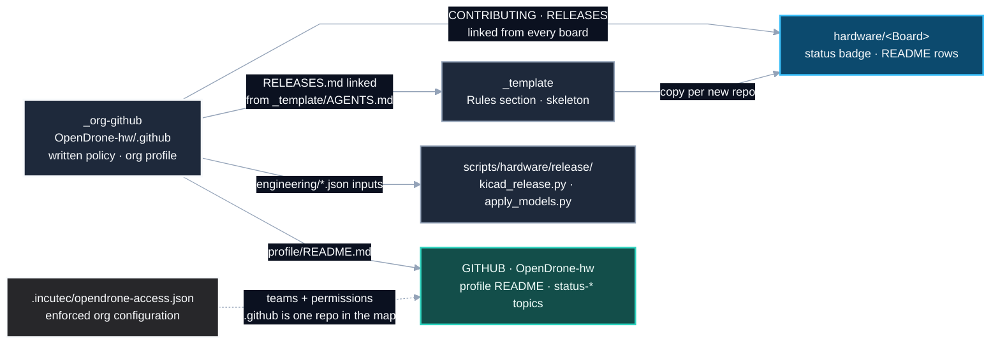
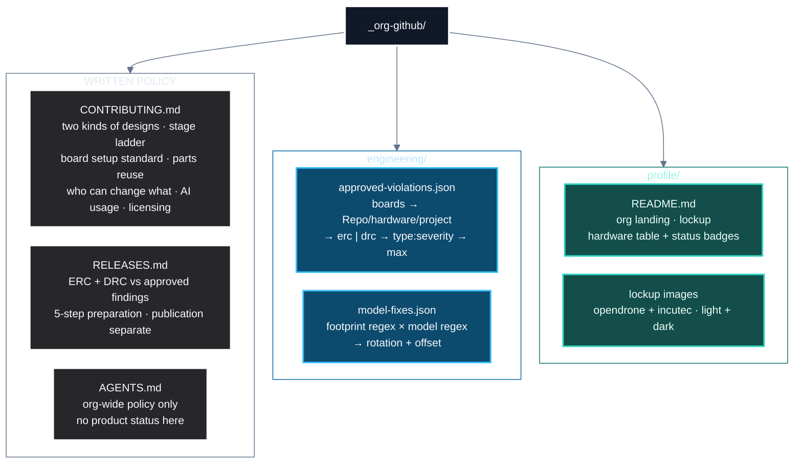
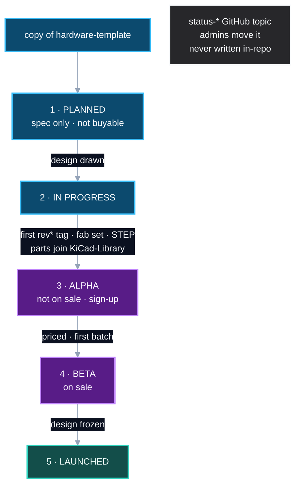
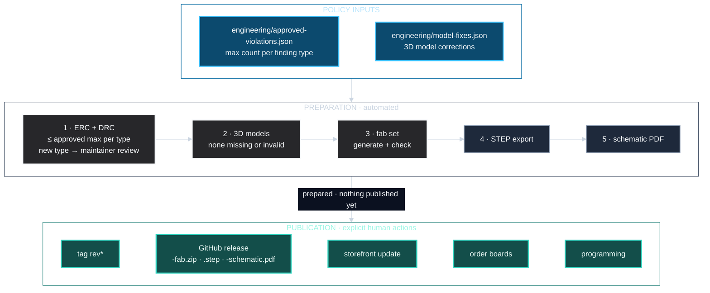
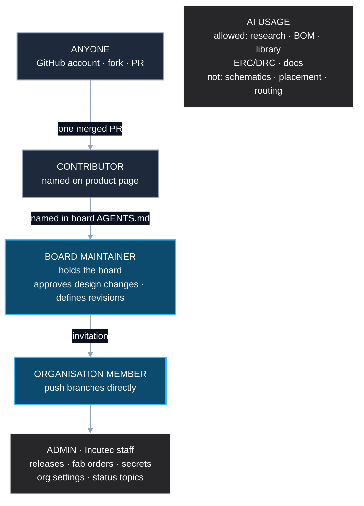

# OpenDrone organization policy

## Position in the workspace

```mermaid
%%{init: {"theme": "base", "themeVariables": {"background": "#0b1120", "lineColor": "#94a3b8", "primaryTextColor": "#f8fafc", "edgeLabelBackground": "#0b1120", "fontSize": "14px"}, "flowchart": {"curve": "linear", "nodeSpacing": 30, "rankSpacing": 60}}}%%
flowchart LR
    ACC[".incutec/opendrone-access.json<br/>enforced org configuration"]
    ORG["_org-github<br/>OpenDrone-hw/.github<br/>written policy · org profile"]
    TPL["_template<br/>Rules section · skeleton"]
    HW["hardware/&lt;Board&gt;<br/>status badge · README rows"]
    SCR["scripts/hardware/release/<br/>kicad_release.py · apply_models.py"]
    GHORG["GITHUB · OpenDrone-hw<br/>profile README · status-* topics"]

    ORG -->|"CONTRIBUTING · RELEASES<br/>linked from every board"| HW
    ORG -->|"RELEASES.md linked<br/>from _template/AGENTS.md"| TPL
    TPL -->|"copy per new repo"| HW
    ORG -->|"engineering/*.json inputs"| SCR
    ORG -->|"profile/README.md"| GHORG
    ACC -.->|"teams + permissions<br/>.github is one repo in the map"| GHORG

    classDef here fill:#1e293b,stroke:#f8fafc,color:#f8fafc,stroke-width:2.5px;
    classDef foundation fill:#1e293b,stroke:#94a3b8,color:#f8fafc,stroke-width:1.5px;
    classDef design fill:#0c4a6e,stroke:#38bdf8,color:#f8fafc,stroke-width:2px;
    classDef control fill:#27272a,stroke:#f8fafc,color:#f8fafc,stroke-width:2px;
    classDef external fill:#134e4a,stroke:#2dd4bf,color:#f0fdfa,stroke-width:2px;

    class ORG here;
    class TPL,SCR foundation;
    class HW design;
    class ACC control;
    class GHORG external;
```

## Repository map

```mermaid
%%{init: {"theme": "base", "themeVariables": {"background": "#0b1120", "lineColor": "#64748b", "primaryTextColor": "#f8fafc", "edgeLabelBackground": "#0b1120", "fontSize": "14px"}, "flowchart": {"curve": "basis", "nodeSpacing": 24, "rankSpacing": 36}}}%%
flowchart TB
    ROOT["_org-github/"]

    ROOT --> POL
    ROOT --> ENG
    ROOT --> PROF

    subgraph POL["WRITTEN POLICY"]
        direction LR
        P1["CONTRIBUTING.md<br/>two kinds of designs · stage ladder<br/>board setup standard · parts reuse<br/>who can change what · AI usage · licensing"]
        P2["RELEASES.md<br/>ERC + DRC vs approved findings<br/>5-step preparation · publication separate"]
        P3["AGENTS.md<br/>org-wide policy only<br/>no product status here"]
    end

    subgraph ENG["engineering/"]
        direction LR
        E1["approved-violations.json<br/>boards → Repo/hardware/project<br/>→ erc | drc → type:severity → max"]
        E2["model-fixes.json<br/>footprint regex × model regex<br/>→ rotation + offset"]
    end

    subgraph PROF["profile/"]
        direction LR
        F1["README.md<br/>org landing · lockup<br/>hardware table + status badges"]
        F2["lockup images<br/>opendrone + incutec · light + dark"]
    end

    classDef root fill:#111827,stroke:#f8fafc,color:#f8fafc,stroke-width:2.5px;
    classDef policy fill:#27272a,stroke:#f8fafc,color:#f8fafc,stroke-width:2px;
    classDef eng fill:#0c4a6e,stroke:#38bdf8,color:#f8fafc,stroke-width:2px;
    classDef prof fill:#134e4a,stroke:#2dd4bf,color:#f0fdfa,stroke-width:2px;

    class ROOT root;
    class P1,P2,P3 policy;
    class E1,E2 eng;
    class F1,F2 prof;

    style POL fill:transparent,stroke:#64748b,color:#e2e8f0;
    style ENG fill:transparent,stroke:#0369a1,color:#bae6fd;
    style PROF fill:transparent,stroke:#0f766e,color:#99f6e4;
```

## Stage ladder

```mermaid
%%{init: {"theme": "base", "themeVariables": {"background": "#0b1120", "lineColor": "#94a3b8", "primaryTextColor": "#f8fafc", "edgeLabelBackground": "#0b1120", "fontSize": "14px"}, "flowchart": {"curve": "linear", "nodeSpacing": 30, "rankSpacing": 44}}}%%
flowchart TB
    S0["copy of hardware-template"] --> S1["1 · PLANNED<br/>spec only · not buyable"]
    S1 -->|"design drawn"| S2["2 · IN PROGRESS"]
    S2 -->|"first rev* tag · fab set · STEP<br/>parts join KiCad-Library"| S3["3 · ALPHA<br/>not on sale · sign-up"]
    S3 -->|"priced · first batch"| S4["4 · BETA<br/>on sale"]
    S4 -->|"design frozen"| S5["5 · LAUNCHED"]

    TOPIC["status-* GitHub topic<br/>admins move it<br/>never written in-repo"]

    classDef design fill:#0c4a6e,stroke:#38bdf8,color:#f8fafc,stroke-width:2px;
    classDef evidence fill:#581c87,stroke:#c084fc,color:#faf5ff,stroke-width:2px;
    classDef release fill:#134e4a,stroke:#2dd4bf,color:#f0fdfa,stroke-width:2px;
    classDef control fill:#27272a,stroke:#f8fafc,color:#f8fafc,stroke-width:2px;

    class S0,S1,S2 design;
    class S3,S4 evidence;
    class S5 release;
    class TOPIC control;
```

## Release preparation vs publication

```mermaid
%%{init: {"theme": "base", "themeVariables": {"background": "#0b1120", "lineColor": "#cbd5e1", "primaryTextColor": "#f8fafc", "edgeLabelBackground": "#0b1120", "fontSize": "14px"}, "flowchart": {"curve": "linear", "nodeSpacing": 26, "rankSpacing": 44}}}%%
flowchart TB
    subgraph INPUTS["POLICY INPUTS"]
        direction LR
        AV["engineering/approved-violations.json<br/>max count per finding type"]
        MF["engineering/model-fixes.json<br/>3D model corrections"]
        AV ~~~ MF
    end

    subgraph PREP["PREPARATION · automated"]
        direction LR
        G1["1 · ERC + DRC<br/>≤ approved max per type<br/>new type → maintainer review"]
        G2["2 · 3D models<br/>none missing or invalid"]
        G3["3 · fab set<br/>generate + check"]
        G4["4 · STEP export"]
        G5["5 · schematic PDF"]
        G1 --> G2 --> G3 --> G4 --> G5
    end

    subgraph PUB["PUBLICATION · explicit human actions"]
        direction LR
        H1["tag rev*"]
        H2["GitHub release<br/>-fab.zip · .step · -schematic.pdf"]
        H3["storefront update"]
        H4["order boards"]
        H5["programming"]
        H1 ~~~ H2 ~~~ H3 ~~~ H4 ~~~ H5
    end

    INPUTS --> PREP
    PREP -->|"prepared · nothing published yet"| PUB

    classDef policy fill:#0c4a6e,stroke:#38bdf8,color:#f8fafc,stroke-width:2px;
    classDef gate fill:#27272a,stroke:#f8fafc,color:#f8fafc,stroke-width:2px;
    classDef step fill:#1e293b,stroke:#94a3b8,color:#f8fafc,stroke-width:1.5px;
    classDef release fill:#134e4a,stroke:#2dd4bf,color:#f0fdfa,stroke-width:2px;

    class AV,MF policy;
    class G1,G2,G3 gate;
    class G4,G5 step;
    class H1,H2,H3,H4,H5 release;

    style INPUTS fill:transparent,stroke:#0369a1,color:#bae6fd;
    style PREP fill:transparent,stroke:#475569,color:#cbd5e1;
    style PUB fill:transparent,stroke:#0f766e,color:#99f6e4;
```

## Roles

```mermaid
%%{init: {"theme": "base", "themeVariables": {"background": "#0b1120", "lineColor": "#94a3b8", "primaryTextColor": "#f8fafc", "edgeLabelBackground": "#0b1120", "fontSize": "14px"}, "flowchart": {"curve": "linear", "nodeSpacing": 30, "rankSpacing": 44}}}%%
flowchart TB
    R0["ANYONE<br/>GitHub account · fork · PR"] -->|"one merged PR"| R1["CONTRIBUTOR<br/>named on product page"]
    R1 -->|"named in board AGENTS.md"| R2["BOARD MAINTAINER<br/>holds the board<br/>approves design changes · defines revisions"]
    R2 -->|"invitation"| R3["ORGANISATION MEMBER<br/>push branches directly"]
    R3 --> R4["ADMIN · Incutec staff<br/>releases · fab orders · secrets<br/>org settings · status topics"]

    AI["AI USAGE<br/>allowed: research · BOM · library<br/>ERC/DRC · docs<br/>not: schematics · placement · routing"]

    classDef open fill:#1e293b,stroke:#94a3b8,color:#f8fafc,stroke-width:1.5px;
    classDef design fill:#0c4a6e,stroke:#38bdf8,color:#f8fafc,stroke-width:2px;
    classDef control fill:#27272a,stroke:#f8fafc,color:#f8fafc,stroke-width:2px;

    class R0,R1 open;
    class R2,R3 design;
    class R4,AI control;
```
